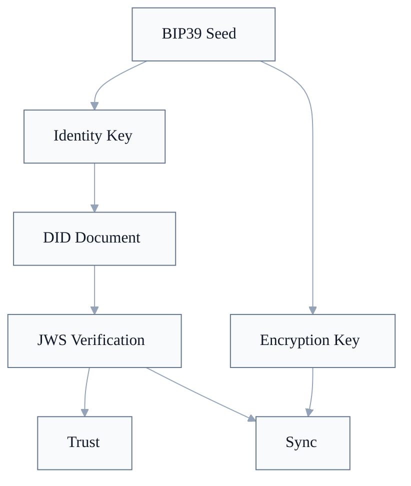

# WoT Identity

Diese README ist eine Leseschicht fuer die Identity-Dokumentfamilie. Normative Anforderungen stehen in den nummerierten Dokumenten und in `CONFORMANCE.md`.

WoT Identity klaert Keys, DID-Dokumente, JWS-Verifikation und Zweckbindung. Trust nutzt diese Basis fuer Attestations; Sync nutzt sie fuer Broker-Auth, Log-Signaturen, Inbox-Adressierung und Verschluesselungs-Key-Discovery.

## Dokumente

| # | Dokument | Rolle |
|---|---|---|
| 001 | [Identitaet und Schluesselableitung](001-identitaet-und-schluesselableitung.md) | BIP39-Seed, HKDF-Pfade, Identity Key, Encryption Key, Shared-Seed-Modell. |
| 002 | [Signaturen und Verifikation](002-signaturen-und-verifikation.md) | JWS Compact Serialization, JCS, `kid`, Algorithmus-Whitelist und Signaturpruefung. |
| 003 | [DID-Dokument und Resolution](003-did-resolution.md) | DID-Dokument-Struktur, `resolve(did)`, `did:key`, `did:webvh`-Pfad und Zweckbindung. |
| 004 | [Device-Key-Delegation](004-device-key-delegation.md) | Geplantes Erweiterungsdokument fuer DeviceKeyBinding und delegierte Device-Signaturen. |

## Identity-Schnitt

| Baustein | Rolle | Normative Quelle |
|---|---|---|
| BIP39 Seed | Gemeinsamer Root fuer deterministic recovery. | [Identity 001: Seed](001-identitaet-und-schluesselableitung.md#seed) |
| Identity Key | Ed25519-Key fuer Identity-gebundene Signaturen. | [Identity 001: Schluesselpaar](001-identitaet-und-schluesselableitung.md#schlüsselpaar), [Identity 002: Signaturalgorithmus](002-signaturen-und-verifikation.md#signaturalgorithmus) |
| Encryption Key | X25519-Key fuer ECIES und Inbox-Kommunikation. | [Identity 001: Weitere Schluessel](001-identitaet-und-schluesselableitung.md#weitere-schlüssel), [Sync 001: Encryption Key Discovery](../03-wot-sync/001-verschluesselung.md#encryption-key-discovery) |
| DID-Dokument | Resolver-Ergebnis mit Verification Methods, Key-Zwecken und optionalen Services. | [Identity 003: DID-Dokument-Struktur](003-did-resolution.md#did-dokument-struktur), [Identity 003: resolve()](003-did-resolution.md#resolve--das-interface) |
| JWS Verification | Signaturmechanik: `kid`, Signing Input, Algorithmus-Whitelist und Public-Key-Aufloesung. | [Identity 002: Signaturformat](002-signaturen-und-verifikation.md#signaturformat-jws-compact-serialization-rfc-7515), [Identity 002: Verifikation](002-signaturen-und-verifikation.md#verifikation) |

## Identity Core und Conformance-Profil

Der Identity Core ist die normative Basis fuer DID-gebundene Keys, JWS und Resolution. [`wot-identity@0.1`](../CONFORMANCE.md#wot-identity01) ist der daraus abgeleitete Conformance-Claim fuer Implementierungen.

1. [BIP39-Seed-Ableitung mit leerer Passphrase](001-identitaet-und-schluesselableitung.md#seed).
2. [HKDF-Info-Strings fuer Identity- und Encryption-Key-Material](001-identitaet-und-schluesselableitung.md#weitere-schlüssel).
3. [Ed25519-JWS mit `alg=EdDSA`, JCS und strikter Algorithmus-Whitelist](002-signaturen-und-verifikation.md#algorithmus-validierung-muss).
4. [`did:key` fuer Ed25519-Identity-Keys](003-did-resolution.md#didkey-phase-1--normativ).
5. [`resolve(did)` fuer DID-Dokumente](003-did-resolution.md#resolve--das-interface) und [Zweckbindung](003-did-resolution.md#zweck-bindung-muss).

Nicht im Identity Core enthalten sind soziale Trust-Semantik, Sync-Transport, Broker-Protokolle, Space-Capabilities und Device-Key-Delegation.

## Resolver-Zustaende

[`did:key`](003-did-resolution.md#didkey-phase-1--normativ) macht WoT in Phase 1 einfach, aber nicht vollstaendig kommunikationsfaehig. Die DID enthaelt nur den Ed25519-Public-Key. Der X25519-Key entsteht aus einem [separaten HKDF-Pfad](001-identitaet-und-schluesselableitung.md#weitere-schlüssel) und ist nicht aus der DID ableitbar.

| Zustand | Was ist verfuegbar? | Reicht fuer |
|---|---|---|
| Signaturfaehig | DID, Ed25519 Verification Method, `authentication`, `assertionMethod`, leeres `keyAgreement`. | Signaturverifikation, Challenge-Response, Broker-Auth. |
| Kommunikationsfaehig | Zusaetzlich `keyAgreement` und optional `service`. | ECIES, Inbox-Zustellung, Profil-/Broker-Discovery. |

Diese Trennung ist zentral: Ein gueltiges `did:key` reicht zum Verifizieren einer Attestation, aber nicht zum Verschluesseln einer Inbox-Nachricht. Dafuer braucht der Resolver den oeffentlichen X25519 Encryption Key des Empfaengers als `keyAgreement` und fuer Inbox-Zustellung ggf. einen `service`-Endpoint. Diese Werte kommen aus [QR-Code, Profil-Service oder lokalem Cache](003-did-resolution.md#did-dokument-quellen).

## Signaturverifikation

Identity 002 definiert den gemeinsamen Verifikationskern: JWS-Form, Algorithmus-Whitelist, `kid`-Aufloesung und Signaturpruefung. Identity 003 liefert die Zweckbindung. Die Semantik des signierten Objekts bleibt bei der hoeheren Schicht: Trust prueft Attestations, Sync prueft Log-Eintraege und Capabilities.

Einstiege: [Identity 002: Verifikation](002-signaturen-und-verifikation.md#verifikation), [Identity 003: Zweck-Bindung](003-did-resolution.md#zweck-bindung-muss), [Trust 001: Verifikation](../02-wot-trust/001-attestations.md#verifikation), [Sync 002: Log-Eintrag](../03-wot-sync/002-sync-protokoll.md#log-eintrag).

## Device-Key-Delegation

[Device-Key-Delegation](004-device-key-delegation.md#architektur-schnitt) ist ein geplantes Erweiterungsdokument in der Identity-Dokumentfamilie, aber nicht Teil von [`wot-identity@0.1`](../CONFORMANCE.md#wot-identity01). Es klaert, welcher technische Device Key fuer eine Identity DID handeln darf. Trust und Sync konsumieren diese Autorisierung, definieren sie aber nicht selbst.

## Offene Architektur-Kanten

| Punkt | Einordnung |
|---|---|
| [`did:key` plus separater X25519-Key](003-did-resolution.md#das-keyagreement-problem-bei-didkey) | Phase-1-Workaround; Resolver muss Zusatzquellen fuer `keyAgreement` nutzen. |
| [Device-UUIDs](../03-wot-sync/002-sync-protokoll.md#device-identifikation) | Sync-Log-Namespace, kein kryptographischer Key. |
| [Device-Key-Delegation](004-device-key-delegation.md#architektur-schnitt) | Geplantes Erweiterungsdokument, nicht Teil von `wot-identity@0.1`. |
| [did:webvh](003-did-resolution.md#didwebvh-phase-2--informativ-nicht-normativ) | Geplanter Resolver mit verifiable History, nicht Pflicht fuer Phase 1. |
| [Space-Capabilities](../03-wot-sync/003-transport-und-broker.md#autorisierung-capabilities) | Nutzen JWS, aber ihr `kid` ist kein DID-URL; Verifikation laeuft ueber Space-Kontext. |
