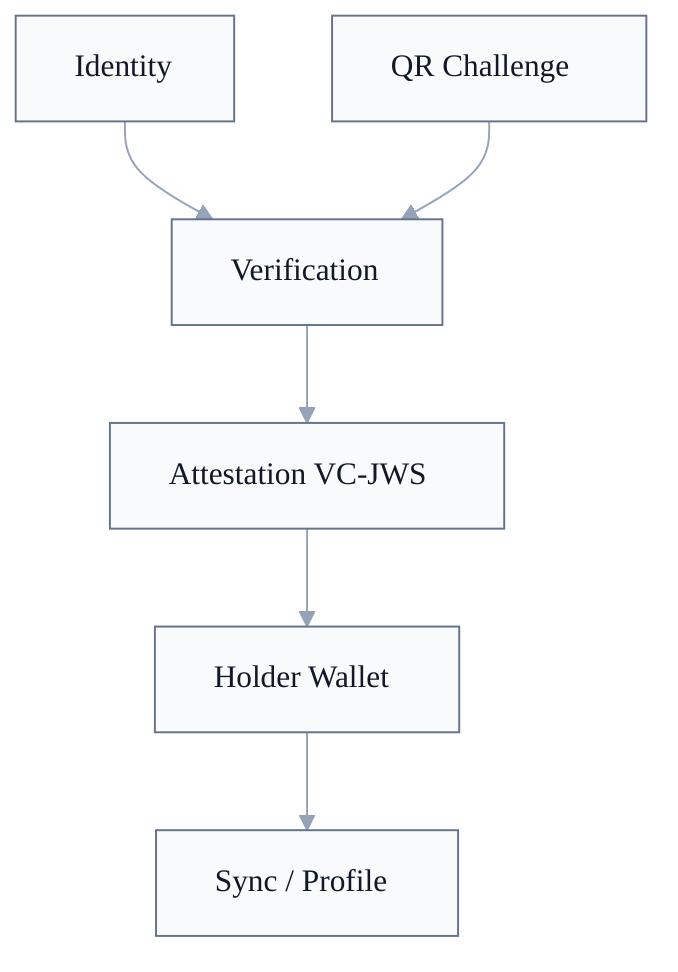

# WoT Trust

Diese README ist eine Leseschicht fuer die Trust-Dokumentfamilie. Normative Anforderungen stehen in den nummerierten Dokumenten und in `CONFORMANCE.md`.

WoT Trust klaert signierte Aussagen zwischen Identitaeten und reale Verifikation. Identity liefert Keys, DID-Resolution und JWS-Verifikation; Sync transportiert Attestations und Verification-Attestations, definiert aber nicht ihre Trust-Semantik.

## Dokumente

| # | Dokument | Rolle |
|---|---|---|
| 001 | [Attestations](001-attestations.md) | W3C VC 2.0 Payloads, VC-JOSE-COSE/JWS, Empfaengerprinzip, Verifikation. |
| 002 | [Verifikation](002-verifikation.md) | QR-Challenges, In-Person-Verifikation, Nonce-History, Verification-Attestations. |

## Trust-Schnitt

| Baustein | Rolle | Normative Quelle |
|---|---|---|
| Identity | Issuer und Subject sind DIDs; JWS-Keys werden ueber Identity aufgeloest. | [Identity 002](../01-wot-identity/002-signaturen-und-verifikation.md#verifikation), [Identity 003](../01-wot-identity/003-did-resolution.md#resolve--das-interface) |
| QR Challenge | Temporärer Nachweis fuer In-Person- oder vertrauenswuerdigen Kanal. | [Trust 002: QR-Code-Format](002-verifikation.md#qr-code-format) |
| Verification | Bindet eine Verification-Attestation an eine aktive Challenge-Nonce oder an eine Remote-Verifikation. | [Trust 002: Acceptance Gate](002-verifikation.md#acceptance-gate-fuer-online-verifikation-muss) |
| Attestation VC-JWS | Signierte Aussage als W3C VC 2.0, transportiert als JWS. | [Trust 001: Format](001-attestations.md#format), [Trust 001: Verifikation](001-attestations.md#verifikation) |
| Holder Wallet | Subject besitzt die Attestation und entscheidet ueber Veroeffentlichung. | [Trust 001: Empfaengerprinzip](001-attestations.md#empfängerprinzip) |

## Trust Core und Conformance-Profil

[`wot-trust@0.1`](../CONFORMANCE.md#wot-trust01) baut auf [`wot-identity@0.1`](../CONFORMANCE.md#wot-identity01) auf. Die Source of Truth sind die verlinkten Spec-Abschnitte:

1. [Attestation-Payloads als W3C VC 2.0](001-attestations.md#format).
2. [VC-JOSE-COSE/JWS mit `typ: "vc+jwt"`](001-attestations.md#transport-jws-compact-serialization-vc-jose-cose-profil).
3. [Issuer-/Subject-Konsistenz und Attestation-Verifikation](001-attestations.md#verifikation).
4. [QR-Challenge-Parsing](002-verifikation.md#qr-code-format).
5. [Nonce-History und Acceptance Gate fuer Online-In-Person-Verifikation](002-verifikation.md#acceptance-gate-fuer-online-verifikation-muss).

Nicht im Trust Core enthalten sind Sync-Zustellung, Broker-Routing, Device-Key-Authority, Trust-Score-Algorithmen und App-spezifische Darstellung.

## Grenzen

| Grenze | Einordnung |
|---|---|
| Identity vs. Trust | Identity sagt, ob eine Signatur und ihr Key gueltig sind. Trust sagt, ob die signierte Aussage als Attestation oder Verification akzeptiert wird. |
| Trust vs. Sync | Trust definiert Attestation-Semantik. Sync transportiert, speichert und repliziert die JWS-Objekte. |
| Attestation vs. Presentation | WoT Trust nutzt VC-JWS direkt. Verifiable Presentations sind spaetere externe Interop-Erweiterung. |
| Verification vs. Trust-Score | Verification bestaetigt Begegnung oder Identitaetsbezug. Quantitative Bewertung ist Extension-Semantik, z.B. HMC. |
| Device-Key-Delegation | Delegierte Signaturen werden in Identity 004 autorisiert; Trust konsumiert diese Autorisierung nur. |

## Offene Architektur-Kanten

| Punkt | Einordnung |
|---|---|
| Remote-Verifikation | Schwaecher als In-Person-Verifikation; Implementierungen duerfen sie anders darstellen oder gewichten. |
| Verifiable Presentations | Nicht Teil von `wot-trust@0.1`, aber fuer externe VC-Interop vorbereitet. |
| Credential Status | Optionales Feld; konkrete Widerrufssemantik liegt bei Extensions. |
| Device-Key-Delegation | Geplantes Erweiterungsprofil; normale `wot-trust@0.1`-Attestations bleiben Identity-Key-signiert. |
