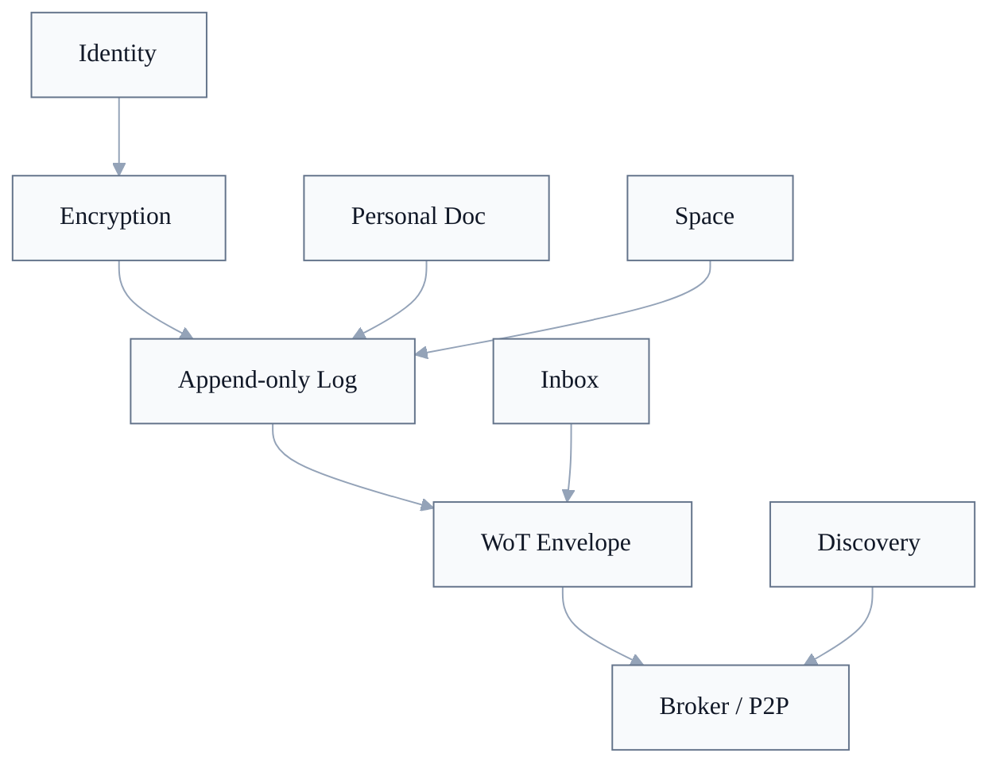

# WoT Sync

Diese README ist eine Leseschicht fuer die Sync-Dokumentfamilie. Normative Anforderungen stehen in den nummerierten Dokumenten und in `CONFORMANCE.md`.

WoT Sync klaert verschluesselten Local-First-Sync, Broker, Inbox, Spaces und Personal Doc. Identity liefert Keys, DID-Resolution und Signaturverifikation. Trust-Artefakte koennen ueber Sync transportiert werden; Sync definiert aber nicht ihre Trust-Semantik.

## Dokumente

| # | Dokument | Rolle |
|---|---|---|
| 001 | [Verschluesselung](001-verschluesselung.md) | AES-256-GCM, ECIES, Encryption-Key-Discovery, Space Keys und Nonce-Konstruktion. |
| 002 | [Sync-Protokoll](002-sync-protokoll.md) | Append-only Logs, `seq`, Log-Entry-JWS, normative Sync-Flows und Generation-Gaps. |
| 003 | [Transport und Broker](003-transport-und-broker.md) | Broker, Authentisierung, Capabilities, per-Device-Inbox, DIDComm-kompatible Plaintext-Envelopes und P2P-Sync. |
| 004 | [Discovery](004-discovery.md) | Broker-Discovery, Profil-Service, DID-Dokument-Quelle und oeffentliche Profilressourcen. |
| 005 | [Gruppen und Mitgliedschaft](005-gruppen.md) | Spaces, Einladungen, Member-Updates, Admin Keys und Key-Rotation. |
| 006 | [Personal Doc und Cross-Device Sync](006-personal-doc.md) | Persoenliches verschluesseltes Dokument, Device-Lifecycle, Self-Addressed Messages und Cross-Device-Recovery. |

## Sync-Schnitt

| Baustein | Rolle | Normative Quelle |
|---|---|---|
| Encryption | Schuetzt Inbox-, Space- und Personal-Doc-Payloads vor dem Transport. | [Sync 001: Verschluesselungs-Schluessel](001-verschluesselung.md#verschlüsselungs-schlüssel), [Sync 001: ECIES](001-verschluesselung.md#peer-to-peer-verschlüsselung-ecies) |
| Append-only Log | Interop-Baseline fuer Dokument-Sync; CRDT-Payload bleibt opak. | [Sync 002: Log](002-sync-protokoll.md#log), [Sync 002: CRDT-Agnostik](002-sync-protokoll.md#crdt-agnostik) |
| Normative Sync-Flows | Reihenfolge fuer Start/Reconnect, lokale Writes, Inbox-ACK, Invites und Generation-Gaps. | [Sync 002: Normative Sync-Flows](002-sync-protokoll.md#normative-sync-flows) |
| Broker / P2P | Immer-online Peer oder direkter Peer; ergaenzt Auth, Store-and-Forward, Capabilities und Push. | [Sync 003: Broker](003-transport-und-broker.md#broker), [Sync 003: Direkter P2P-Sync](003-transport-und-broker.md#direkter-p2p-sync) |
| WoT Envelope | Ephemeres DIDComm-kompatibles Plaintext-Framing fuer Sync-Nachrichten. | [Sync 003: WoT Message Envelope](003-transport-und-broker.md#wot-message-envelope-didcomm-kompatibel) |
| Inbox | Per-Device Store-and-Forward fuer direkte verschluesselte Nachrichten und Control-Messages. | [Sync 003: Store-and-Forward pro Device](003-transport-und-broker.md#store-and-forward-pro-device), [Sync 002: Inbox-Verarbeitung](002-sync-protokoll.md#inbox-verarbeitung-und-ack) |
| Capabilities | Broker-Autorisierung fuer Space- und Personal-Doc-Zugriff. | [Sync 003: Autorisierung](003-transport-und-broker.md#autorisierung-capabilities), [Sync 005: Capability-Pruefung](005-gruppen.md#capability-prüfung) |
| Discovery | Findet Broker, Profil-Service, DID-Dokumente und Encryption Keys. | [Sync 004: Broker-Discovery](004-discovery.md#broker-discovery), [Sync 004: Profil-Service](004-discovery.md#profil-service) |
| Spaces | Gruppen-Dokumente mit Content Keys, Capability Keys, Member-Updates und Rotation. | [Sync 005: Grundprinzip](005-gruppen.md#grundprinzip), [Sync 005: Key-Rotation](005-gruppen.md#key-rotation-member-entfernung) |
| Personal Doc | Persoenliches Dokument fuer Profil, Kontakte, Attestations, Spaces, Group Keys und Devices. | [Sync 006: Struktur des Personal Doc](006-personal-doc.md#struktur-des-personal-doc), [Sync 006: Sync-Mechanismus](006-personal-doc.md#sync-mechanismus) |

## Sync Core und Conformance-Profil

[`wot-sync@0.1`](../CONFORMANCE.md#wot-sync01) baut auf [`wot-identity@0.1`](../CONFORMANCE.md#wot-identity01) auf. `wot-trust@0.1` ist fuer Sync nicht erforderlich. Die Source of Truth sind die verlinkten Spec-Abschnitte:

1. [AES-256-GCM, ECIES und Encryption-Key-Discovery](001-verschluesselung.md).
2. [Append-only Log, `seq`-Konsistenz und Log-Entry-JWS](002-sync-protokoll.md#log).
3. [Normative Sync-Flows](002-sync-protokoll.md#normative-sync-flows).
4. [Broker-Authentisierung, Capabilities und per-Device-Inbox](003-transport-und-broker.md).
5. [DIDComm-kompatibles Plaintext-Envelope als ephemeres Transport-Framing](003-transport-und-broker.md#wot-message-envelope-didcomm-kompatibel).
6. [Discovery](004-discovery.md), [Gruppen](005-gruppen.md) und [Personal Doc](006-personal-doc.md).

Nicht im Sync Core enthalten sind Trust-Score-Algorithmen, App-spezifische CRDT-Semantik, UI-Zustaende, DIDComm-JWE/Authcrypt, Broker-zu-Broker-Replikation und zukuenftige Log-Kompression oder Set-Reconciliation.

## Grenzen

| Grenze | Einordnung |
|---|---|
| Sync vs. Identity | Identity sagt, wer signieren und entschluesseln kann. Sync nutzt diese Keys fuer Broker-Auth, Log-Entry-Verifikation und Inbox-Verschluesselung. |
| Sync vs. Trust | Sync transportiert Attestations und Verifications, bewertet sie aber nicht. Trust prueft ihre Semantik. |
| Log vs. Envelope | Log-Eintraege, Capabilities und Attestations sind persistente WoT-Objekte. Envelopes sind ephemeres Transport-Framing. |
| Broker vs. Peer | Der Broker ist ein immer-online Peer mit Store-and-Forward, Auth und Capability-Pruefung; das Sync-Protokoll bleibt peer-agnostisch. |
| Space vs. Personal Doc | Beide nutzen dieselbe Log-Infrastruktur. Spaces verteilen zufaellige Group Keys, das Personal Doc leitet seinen Key deterministisch aus dem Seed ab. |
| CRDT vs. Sync | Sync transportiert verschluesselte Payloads und Heads; die konkrete CRDT-Semantik liegt bei der App oder Extension. |

## Offene Architektur-Kanten

| Punkt | Einordnung |
|---|---|
| Log-Kompression und Set-Reconciliation | Als Phase 2/3 beschrieben, aber nicht Teil von `wot-sync@0.1`. |
| Snapshots und Full-State | Optionale Optimierungen; sie ersetzen keinen Log-Catch-Up und duerfen bekannte gueltige Log-Eintraege nicht zurueckrollen. |
| Broker-zu-Broker-Replikation | Nicht normiert; Clients synchronisieren mehrere Broker lokal und vergleichen Heads. |
| P2P ohne Broker | Unterstuetzt direkte Sync-Runden, aber keine garantierte Store-and-Forward-Inbox. |
| Device-Key-Delegation | Geplantes Identity-Erweiterungsprofil; Sync nutzt delegierte Signaturen erst, wenn Identity sie autorisiert. |
