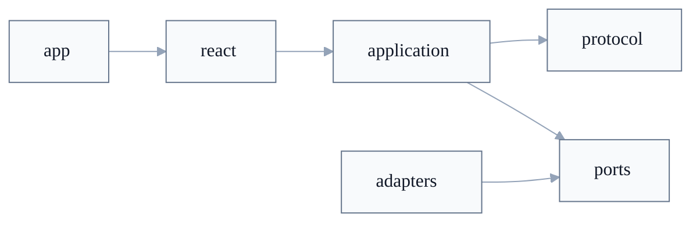

# Implementierungs-Architektur

> **Nicht normativ:** Dieses Dokument beschreibt das Ziel-Mapping fuer die TypeScript-Referenzimplementierung. Normative Anforderungen stehen in den nummerierten Spec-Dokumenten, Schemas, Test-Vektoren und `CONFORMANCE.md`.

## Ziel

Die TypeScript-Implementierung soll die Spec-Grenzen sichtbar machen, statt Protokollregeln, App-Workflows, UI und Infrastruktur in einem Importraum zu vermischen.

Der Pfeil zeigt zur erlaubten Abhaengigkeit: `application` darf `protocol` verwenden, aber `protocol` darf `application` nicht kennen. `adapters` implementieren `ports`; `application` orchestriert gegen `ports` und nicht gegen konkrete Adapter.

## Layer-Regeln

| Layer | Aufgabe | Darf kennen | Darf nicht kennen | Aktueller Anker |
|---|---|---|---|---|
| `protocol` | Deterministische Spec-Objekte, Encoding, Signatur-/Payload-Verifikation, Testvektor-nahe Funktionen. | Kleine Crypto-Ports, reine Typen. | Storage, Network, CRDT, React, App-Services. | `web-of-trust/packages/wot-core/src/protocol/` |
| `application` | Use-Cases und Workflows: Identity, Verification, Attestations, Spaces, Sync-Orchestrierung. | `protocol`, `ports`, reine Domain-Typen. | Browser APIs, konkrete Datenbanken, konkrete Broker/CRDT-Adapter, UI. | `web-of-trust/packages/wot-core/src/application/`, Teile von `src/services/` |
| `ports` | Interfaces fuer Storage, Crypto, Network, Discovery, Replication, Outbox, Authorization, Clock/Random. | Reine Typen aus `protocol` oder Domain-Typen. | Adapter-Implementierungen, UI, Produktlogik. | `web-of-trust/packages/wot-core/src/ports/`, aktuell auch `src/adapters/interfaces/` |
| `adapters` | Konkrete Implementierungen fuer Browser, Server, CRDTs, Broker, Profil-Service, Vault oder lokale Persistenz. | `ports`, ggf. `protocol` fuer Wire-Objekte. | `application`-Use-Cases als harte Abhaengigkeit, UI-State als Protokollautoritaet. | `src/adapters/`, `packages/adapter-yjs/`, `packages/adapter-automerge/`, App-lokale Adapter |
| `react` | Wiederverwendbare Hooks und Contexts ueber Application-Use-Cases. | `application`-Interfaces, View-Model-Typen. | Rohe Protokollinternals, konkrete Adapter, Browser-Persistenz ausserhalb von App-Wiring. | Derzeit app-lokal in `apps/demo/src/hooks/` und `apps/demo/src/context/` |
| `app` | Runtime Composition, Routing, Produkt-UI, Konfiguration, Deployment-spezifisches Wiring. | `react`, `application`, konkrete Adapter an der Composition Root. | Eigene Protokollregeln oder alternative Verifikation. | `apps/demo/src/runtime/appRuntime.ts`, `apps/demo/src/App.tsx`, `apps/demo/src/pages/` |
| Server-Infrastruktur | Referenzdienste fuer Sync/Discovery/Vault. | Protokollobjekte, Ports, Server-Adapter. | Normative App-Semantik, UI-Annahmen. | `packages/wot-relay/`, `packages/wot-profiles/`, `packages/wot-vault/`, `packages/wot-cli/` |

## Spec-Familien zu TypeScript

| Spec-Familie | Primaere TS-Orte | Zielgrenze |
|---|---|---|
| WoT Identity | `src/protocol/identity/`, `src/protocol/crypto/`, `src/application/identity/`, `src/ports/identity-vault.ts`, `src/protocol-adapters/web-crypto.ts` | Key-Derivation, DID und JWS bleiben in `protocol`; Seed-Speicherung und Session-Workflow gehoeren zu `application` plus `ports`. |
| WoT Trust | `src/protocol/trust/`, `src/application/attestations/`, `src/application/verification/` | VC-JWS-Verifikation gehoert zu `protocol`; Erzeugen, Importieren, Anzeigen und Zustellen gehoeren zu `application` und App. |
| WoT Sync | `src/protocol/sync/`, `src/application/spaces/`, `src/services/`, `src/ports/spaces.ts`, `packages/adapter-yjs/`, `packages/adapter-automerge/`, `packages/wot-relay/` | Log-/Capability-/Encryption-Objekte gehoeren zu `protocol`; Sync-State-Machine und Workflows zu `application`; CRDT, Broker und Persistenz zu `adapters`. |
| Discovery/Profile | `src/adapters/discovery/`, `src/services/ProfileService.ts`, `packages/wot-profiles/` | Profil-Service-Verifikation muss Spec-Objekte nutzen; HTTP und Cache bleiben Adapter-/Service-Infrastruktur. |
| RLS/HMC Extensions | Aktuell nur teilweise in `src/protocol/trust/sd-jwt-vc.ts` und App-/Extension-Code | Extension-Semantik darf Trust/Sync nutzen, aber nicht in Identity oder Sync-Core wandern. |

## Aktuelle TypeScript-Landkarte

| Paket/Bereich | Aktuelle Rolle | Zielrolle |
|---|---|---|
| `@web_of_trust/core` | Mischt heute Protocol Core, Application Workflows, Ports, Services, Adapter-Interfaces, Browser-Adapter und Debug-Hilfen im Root-Export. | Logischer Kern mit klaren Entry-Points fuer `protocol`, `application`, `ports` und explizite Adapter-Submodule. |
| `packages/wot-core/src/protocol/` | Bereits als Spec-nahe Protocol-Core-Schicht angelegt. | Bleibt die deterministische Protokollbasis und orientiert sich an `wot-spec` Test-Vektoren. |
| `packages/wot-core/src/application/` | Workflows fuer Identity, Verification, Attestations und Spaces. | App-nutzbare Use-Cases, die gegen Ports orchestrieren. |
| `packages/wot-core/src/services/` | Gemischte Orchestrierung und Infrastrukturhilfen, z.B. Profile, Encrypted Sync, Group Keys, Vault Push. | Aufteilen in Application-Use-Cases oder Adapter-/Infra-Services. |
| `packages/wot-core/src/adapters/interfaces/` | Effektiv viele Ports, aber unter Adapter-Pfad. | Nach `src/ports/` konsolidieren. |
| `packages/wot-core/src/adapters/` | Browser-/Memory-/HTTP-/WebSocket-/Storage-Implementierungen im Core-Paket. | Konkrete Adapter klar von Application/Protocol trennen; ggf. eigene Adapter-Entry-Points oder Pakete. |
| `packages/adapter-yjs/` | Yjs Personal Doc, Storage, Sync und Replication. | CRDT-/DocStore-/Replication-Adapter, nicht normative Sync-State-Machine-Autoritaet. |
| `packages/adapter-automerge/` | Automerge Personal Doc, Replication, Storage und Outbox. | CRDT-/DocStore-/Replication-Adapter mit denselben Port-Grenzen wie Yjs. |
| `apps/demo/` | App, React, Runtime Composition und app-lokale Adapter. | Composition Root plus Produkt-UI; Hooks konsumieren Application-Use-Cases statt rohe Protokollinternals. |
| `packages/wot-relay/` | Broker/Relay. | Referenzimplementierung fuer Sync 003 Broker-Verhalten. |
| `packages/wot-profiles/` | Profil-Service. | Referenzimplementierung fuer Sync 004 Profil-Service. |
| `packages/wot-vault/` | Vault-Service und vendored `wot-core-dist`. | Externe Infrastruktur; nach Core-Aenderungen `packages/wot-vault/docker-build.sh` nutzen, um `wot-core-dist` zu refreshen. |
| `packages/wot-cli/` | CLI und Server-/Storage-Integration. | Referenz-Consumer fuer Ports und Adapter ausserhalb der Demo-App. |

## Import-Regeln

| Von | Erlaubt | Nicht erlaubt |
|---|---|---|
| `protocol` | Reine Hilfsfunktionen, kleine Ports, lokale Typen. | `application`, `services`, `adapters`, React, App-Code. |
| `application` | `protocol`, `ports`, Domain-Typen. | Konkrete Adapter, `window`, `document`, `indexedDB`, direkte WebSocket-/HTTP-Implementierung. |
| `ports` | Reine Typen. | Adapter-Implementierungen oder Workflow-Code. |
| `adapters` | `ports`, Wire-/Payload-Typen aus `protocol`, Plattform-APIs. | UI-State oder Application-Use-Cases als notwendige Abhaengigkeit. |
| `react` | Application-Use-Cases, View-Models. | Direkte Protokoll-Erzeugung/-Verifikation ausserhalb bewusst technischer Debug-Views. |
| `app` | Alles an der Composition Root, aber nur dort. | Eigene alternative Protokollregeln. |

## Bekannte Abweichungen

Diese Punkte sind Implementierungsdebt, keine Spec-Aussagen.

| Punkt | Aktueller Zustand | Ziel |
|---|---|---|
| Root-Export | `packages/wot-core/src/index.ts` exportiert Typen, Protocol, Application, Ports, Services, Adapter und Debug-Hilfen zusammen. | Oeffentliche API in Schichten gliedern; Apps importieren bevorzugt aus klaren Namespaces. |
| Ports | Nur wenige Interfaces liegen in `src/ports/`; viele liegen in `src/adapters/interfaces/`. | Alle Ports in `src/ports/`, Adapter implementieren sie. |
| Browser-Adapter im Core | `HttpDiscoveryAdapter`, `WebSocketMessagingAdapter`, IndexedDB-/LocalStorage-Adapter und Debug-Storage liegen im Core-Paket. | Konkrete Browser-/Storage-Adapter aus Application-Grenze herausziehen. |
| Services | Teile von `src/services/` sind Application-Orchestrierung, andere Infrastruktur. | Services klassifizieren und verschieben: Use-Case nach `application`, Infrastruktur nach `adapters` oder Server-Pakete. |
| Crypto-Duplikation | Es gibt `src/protocol/crypto/` und `src/crypto/`. | Ein Spec-naher Protocol-Crypto-Kern; doppelte Hilfen entfernen oder eindeutig zuordnen. |
| Adapter-Abhaengigkeiten | CRDT-Adapter importieren teilweise Core-Services wie `GroupKeyService`, `EncryptedSyncService` oder `VaultPushScheduler`. | Adapter gegen Ports und Protokolltypen implementieren; Application komponiert Services. |
| Demo-Importe | Hooks und Services in `apps/demo/` importieren teilweise `protocol` oder Signaturhelfer direkt. | React/App konsumiert Workflows; direkte Protocol-Imports nur fuer Debug-/Interop-Oberflaechen. |
| React-Schicht | Es gibt noch kein wiederverwendbares React-Paket. | Erst extrahieren, wenn ein zweiter Consumer die Hooks/Contexts braucht. |

## Migrationsreihenfolge

1. Spec-Leseschicht und Conformance-Artefakte gruen halten.
2. Layer-Entry-Points dokumentieren und neue Imports daran ausrichten.
3. Adapter-Interfaces aus `src/adapters/interfaces/` nach `src/ports/` konsolidieren.
4. `src/services/` in Application-Use-Cases und Infrastruktur-Adapter aufteilen.
5. Browser-/Storage-/Network-Adapter aus dem Core-Root-Export entfernen oder explizit als Adapter-Entry-Points fuehren.
6. Yjs und Automerge auf CRDT-/DocStore-/Replication-Adapter begrenzen; die normative Sync-Reihenfolge bleibt in Application/Protocol abgebildet.
7. Demo-Hooks und App-Services auf Application-Use-Cases umstellen.
8. Optionales React-Paket erst erstellen, wenn Wiederverwendung den Split rechtfertigt.

## Definition of Done Fuer Einen Groesseren TS-Umbau

1. `protocol` reproduziert die relevanten `wot-spec` Test-Vektoren und importiert keine App-/Adapter-Schichten.
2. `application` nutzt Ports fuer Storage, Network, Discovery, Replication und Crypto-Umgebung.
3. Konkrete Adapter besitzen keine Protokollautoritaet und duerfen bekannte gueltige Protokollobjekte nicht durch lokale Heuristiken ersetzen.
4. React-Hooks konsumieren Use-Cases oder View-Models, nicht rohe Wire-Objekte.
5. `apps/demo/src/runtime/appRuntime.ts` oder ein aequivalenter Composition-Root verdrahtet konkrete Adapter.
6. `npm run validate` in `wot-spec` bleibt gruen.
7. Relevante `web-of-trust` Checks laufen fuer geaenderte Pakete, mindestens `pnpm --filter @web_of_trust/core test`, `typecheck` und `build` bei Core-Aenderungen.
