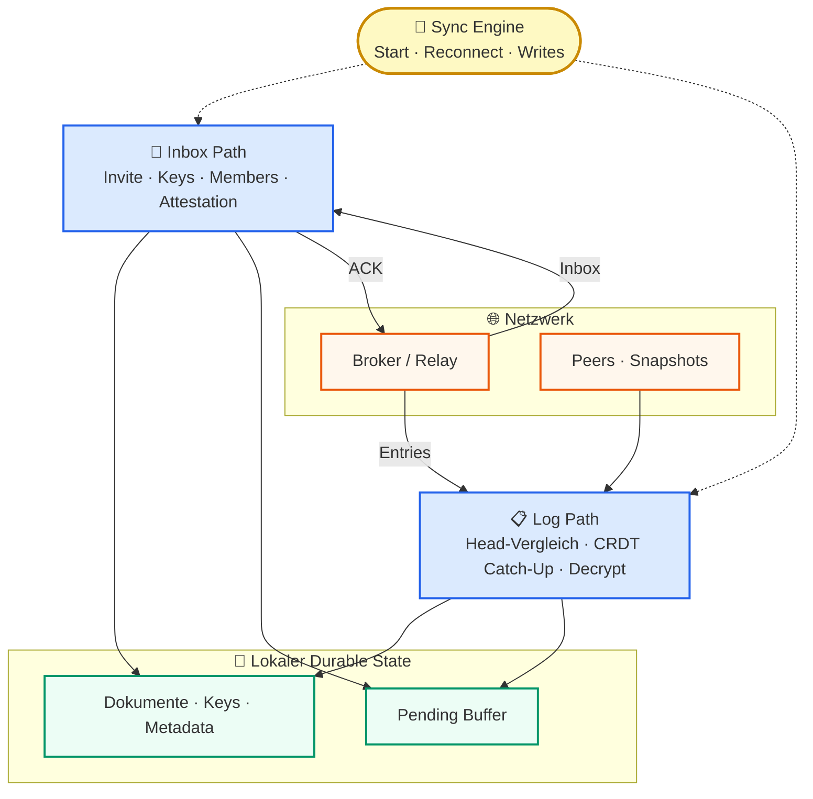
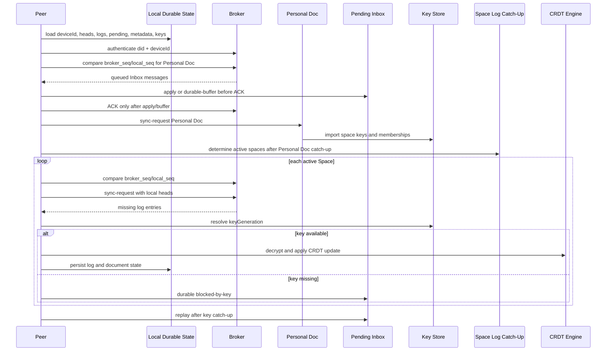
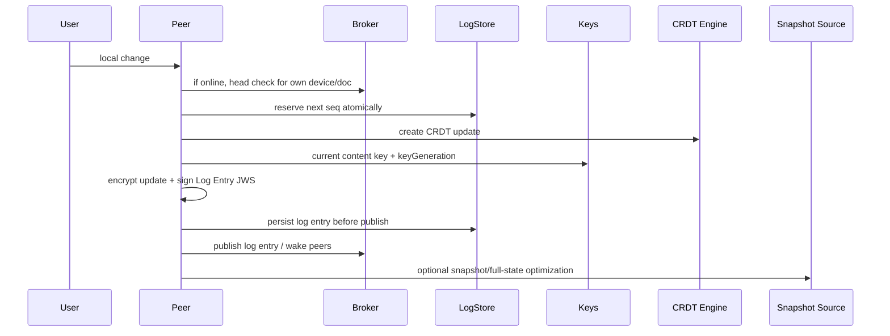
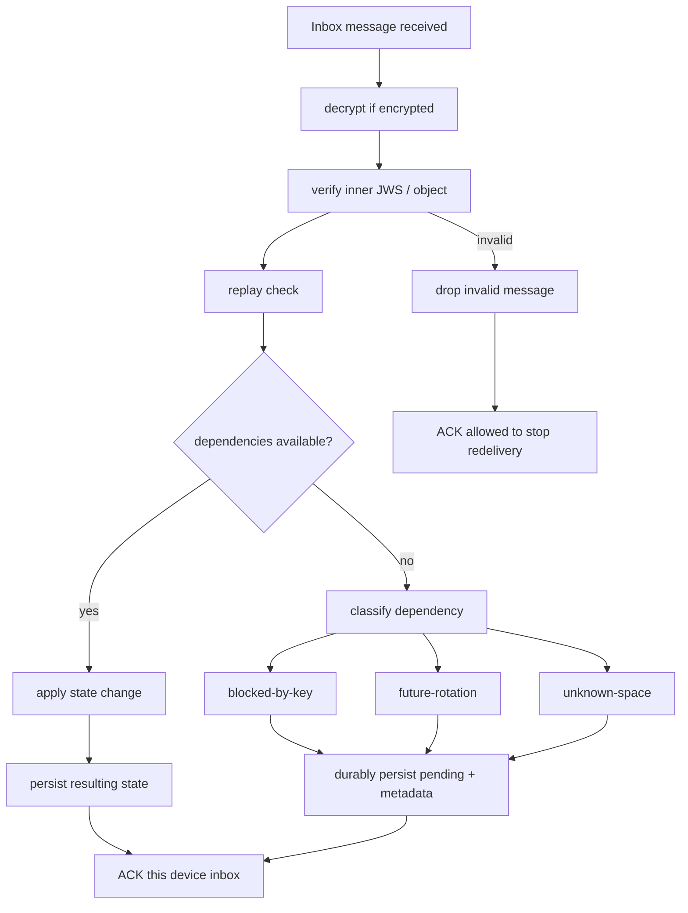
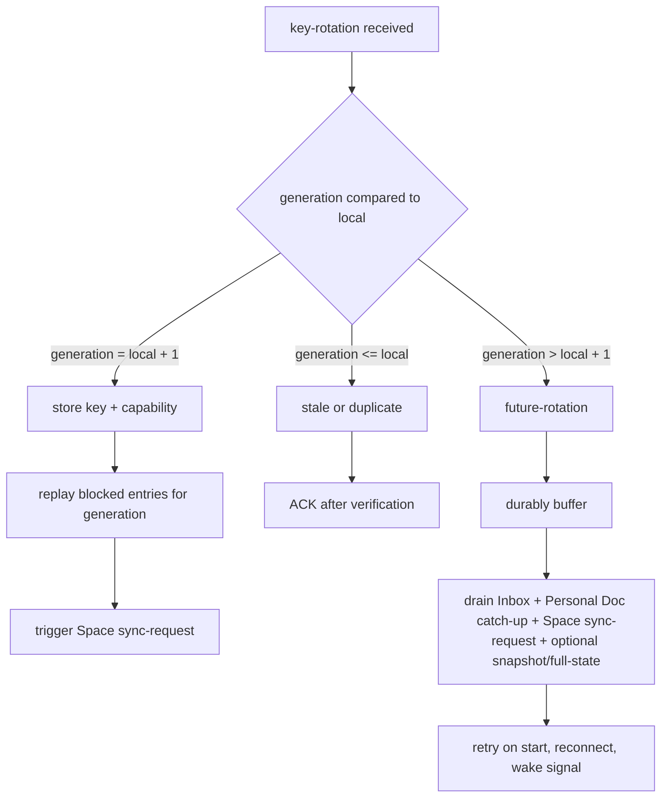
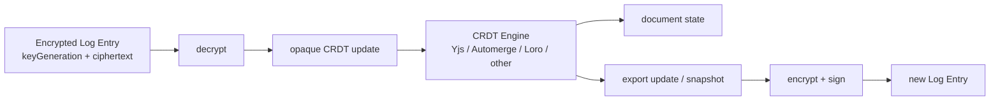
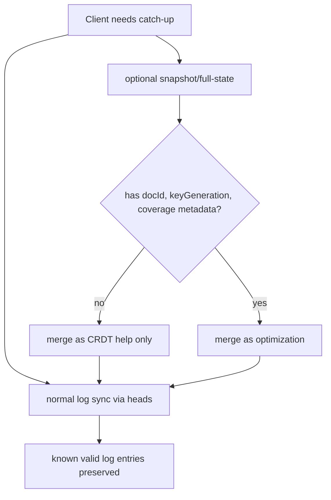

# WoT Sync-Zielarchitektur

> **Nicht normativ:** Dieses Dokument beschreibt ein gemeinsames mentales Modell fuer die Sync-Architektur. Normative Anforderungen stehen in `03-wot-sync/*` und `CONFORMANCE.md`.

- **Status:** Entwurf
- **Datum:** 2026-05-02
- **Bezug:** `wot-sync@0.1`

## Ziel

Dieses Dokument trennt die Protokollrollen von konkreten Implementierungen. Es sagt nicht, ob eine Implementierung Yjs, Automerge, Loro, IndexedDB, SQLite, WebSocket oder einen anderen Transport verwendet. Entscheidend ist, dass alle Implementierungen dieselben Sync-Abhaengigkeiten, ACK-Zeitpunkte und Recovery-Regeln einhalten.

## Architekturrollen

<!-- Uebersicht: 30-Sekunden-Bild. Details in den Diagrammen weiter unten. -->

> **Nicht gezeigt:** Key Store, Log Store, Device State, Key Resolver, ACK Policy, CRDT Engine — diese Rollen sind in der Tabelle unten beschrieben und in den Detail-Diagrammen (Startup, Inbox-Flow, Key-Rotation) aufgeschluesselt.

## Verantwortung Der Rollen

| Rolle | Verantwortung | Normativer Bezug |
|---|---|---|
| Sync State Machine | Orchestriert App-Start, Reconnect, lokale Writes, Catch-Up und Pending-Replay | `03-wot-sync/002` |
| Inbox Processor | Verarbeitet direkte Inbox-Nachrichten wie Invite, Member Update, Key Rotation, Attestation, Verification | `03-wot-sync/002`, `003`, `005` |
| ACK Policy | Sendet ACK erst nach Anwendung oder durablem Pending-Speicher | `03-wot-sync/002`, `003` |
| Log Catch-Up | Vergleicht Heads und laedt fehlende Log-Eintraege | `03-wot-sync/002`, `003` |
| Key Dependency Resolver | Erkennt `blocked-by-key` und `future-rotation` und triggert Key-/Personal-Doc-Catch-Up | `03-wot-sync/002`, `005`, `006` |
| CRDT Document Engine | Wendet entschluesselte Updates an und exportiert Updates/Snapshots | CRDT-agnostisch, durch `03-wot-sync/002` nur als Payload betrachtet |
| Pending Inbox | Crash-sicherer lokaler Speicher fuer nicht anwendbare, aber gueltige Nachrichten/Eintraege | `03-wot-sync/002`, `003` |
| Broker / Relay | Authentisiert DID + Device, verwaltet per-device Inbox, liefert Nachrichten, beantwortet Sync-Requests | `03-wot-sync/003` |
| Snapshot / Full-State Source | Optimiert Restore/Catch-Up, ersetzt aber nie Log-Catch-Up als Norm | `03-wot-sync/002` |

## Start Und Reconnect

Kernaussagen:

- Personal Doc kommt vor Space-Dokumenten, weil Space-Mitgliedschaften und Group Keys dort liegen koennen.
- Inbox-Nachrichten duerfen als Wecksignal dienen, ersetzen aber keinen Log-Catch-Up.
- Ein ACK ist nur erlaubt, wenn der Client nach Crash ohne erneute Broker-Zustellung fortfahren kann.
- Ein unbekannter Key ist kein Fehler zum Verwerfen, sondern ein Abhaengigkeitszustand.

## Lokaler Schreibvorgang

Kernaussagen:

- Lokaler State entsteht zuerst lokal und durable.
- Publikation an Broker/Peers ist retrybar und idempotent.
- Log-Eintraege verwenden keine Inbox-ACK-Semantik.
- Snapshots duerfen beschleunigen, aber keine gueltigen Log-Eintraege ersetzen oder zurueckrollen.

## Inbox, Pending Und ACK

Pending-Metadaten muessen mindestens enthalten:

- Message- oder Log-Entry-ID
- betroffene `docId` oder Space-ID
- Abhaengigkeitsart
- erwartete `keyGeneration`, falls vorhanden
- ausreichend Daten, um die Nachricht spaeter erneut zu pruefen und anzuwenden

Der Speicherort ist implementationsspezifisch. Er muss aber crash-sicher sein und App-Neustarts ueberleben.

## Key-Rotation Und Generation-Gaps

`wot-sync@0.1` definiert kein generisches `key-request` Nachrichtenformat. Fehlende Rotationen oder Keys werden ueber bestehende Quellen gesucht:

- eigene Device-Inbox
- Personal Doc Catch-Up
- Space `sync-request`
- optionale Snapshot-/Full-State-Quelle

## CRDT-Agnostik

Das Sync-Protokoll behandelt CRDT-Daten als verschluesselten Payload. Es normiert Signatur, Log, Keys, Catch-Up und ACK-Regeln, aber nicht die interne CRDT-Datenstruktur.

## Snapshot Und Full-State

Snapshots und Full-State-Nachrichten sind Optimierungen. Sie duerfen keinen bekannten gueltigen Log-Eintrag loeschen, ueberschreiben oder als normative Recovery ersetzen.

## Spec-Bezuege

| Normative Quelle | Inhalt | Architekturrolle |
|---|---|---|
| `03-wot-sync/002-sync-protokoll.md` | Normative Sync-Flows, App-Start, Reconnect, lokale Writes, Pending, blocked-by-key, future-rotation, Snapshots | Sync State Machine, Pending Inbox, Log Catch-Up, Key Resolver |
| `03-wot-sync/003-transport-und-broker.md` | Broker Auth, per-device Inbox, ACK, sync-request/response, self-addressed delivery | Broker/Relay, ACK Policy, Transport |
| `03-wot-sync/005-gruppen.md` | Space Invite, Member Update, Key Rotation, Generation-Gaps | Key Resolver, Group/Membership Workflow |
| `03-wot-sync/006-personal-doc.md` | Personal Doc, Self-addressed Messages, Personal Doc vor Space Sync | Startup/Reconnect Flow, Key Store, Space Metadata |
| `CONFORMANCE.md` | pruefbare Anforderungen fuer `wot-sync@0.1` | Conformance Tests und Implementierungs-Checkliste |

## Implementierungsleitlinien

- Implementierungen duerfen Technologien frei waehlen, solange die Rollen und Abhaengigkeiten eingehalten werden.
- Broker duerfen Inhalte nicht als Autoritaetsanker interpretieren; autoritative Pruefung liegt beim Client.
- Transport kann WebSocket, QUIC, Bluetooth, Sneakernet oder P2P sein; Sync-Semantik bleibt gleich.
- Pending darf nicht volatil sein, wenn danach ACK gesendet wird.
- CRDT-Engine ist austauschbar und darf nicht ueber ACK, Key-Gaps oder Broker-Catch-Up entscheiden.
- Snapshot-/Vault-/Full-State-Mechanismen bleiben Optimierungen und muessen mit Log-Catch-Up kombiniert werden.
